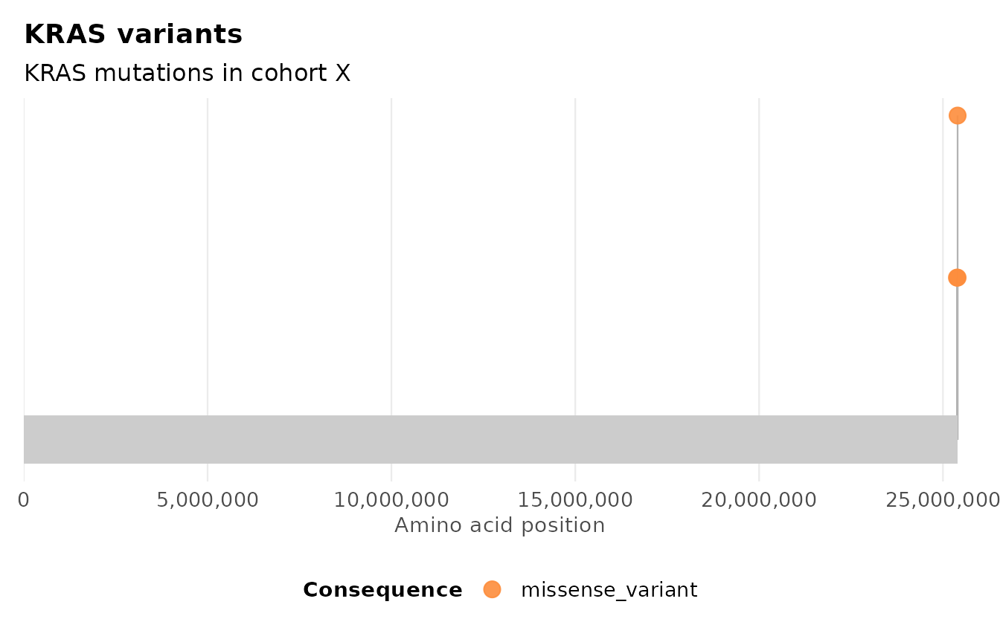
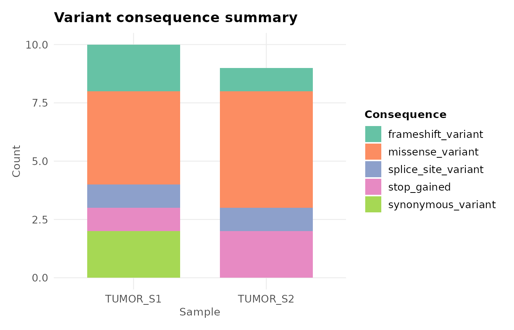
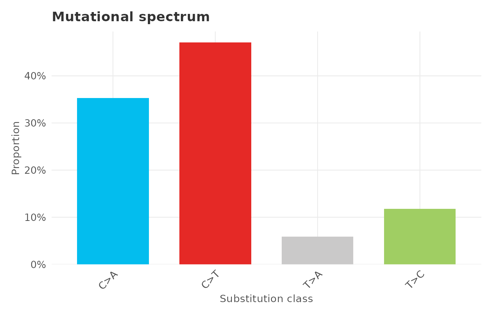
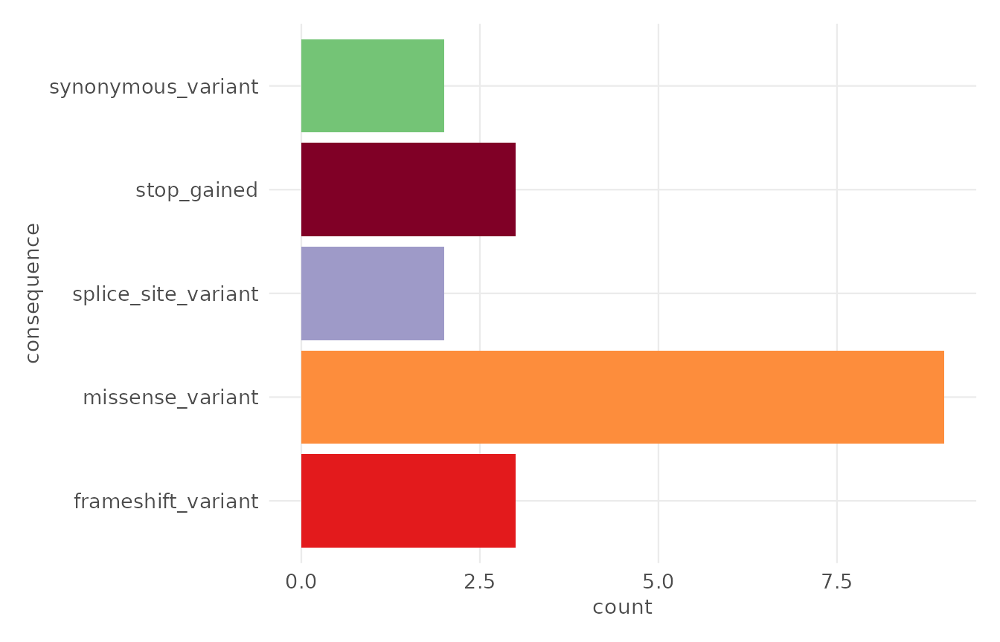

# Customising plots with ggplot2

``` r

library(ggvariant)
library(ggplot2)

vcf_file <- system.file("extdata", "example.vcf", package = "ggvariant")
variants <- read_vcf(vcf_file)
#> ℹ Reading VCF: example.vcf
#> ✔ Reading VCF: example.vcf [28ms]
#> 
#> Loaded 19 variant records across 7 chromosomes.
```

Every `ggvariant` plot function returns a standard `ggplot` object (not
a subclass, not a wrapped list), so any `ggplot2` layer, scale, theme,
or annotation composes onto it exactly as it would onto a plot you built
by hand.

## Adding layers

``` r

plot_lollipop(variants, gene = "KRAS") +
  labs(subtitle = "KRAS mutations in cohort X") +
  theme(legend.position = "bottom")
```



## Overriding a scale

`ggvariant` sets a fill or colour scale internally, so replacing it
means adding a new `scale_*` call after the plot is built – `ggplot2`
uses the last matching scale in the layer stack.

``` r

plot_consequence_summary(variants) +
  scale_fill_brewer(palette = "Set2", name = "Consequence")
#> Scale for fill is already present.
#> Adding another scale for fill, which will replace the existing scale.
```



## Building on `theme_ggvariant()`

[`theme_ggvariant()`](https://josh45-source.github.io/ggvariant/reference/theme_ggvariant.md)
is exported, so you can start from it rather than
[`theme_minimal()`](https://ggplot2.tidyverse.org/reference/ggtheme.html)
when building a custom plot from scratch, or layer further
[`theme()`](https://ggplot2.tidyverse.org/reference/theme.html) tweaks
onto a `ggvariant` plot’s existing theme.

``` r

plot_variant_spectrum(variants) +
  theme(
    axis.text.x = element_text(angle = 45, hjust = 1),
    plot.title  = element_text(colour = "grey20")
  )
#> Excluded 2 non-SNV records from spectrum plot.
```



## Combining with `gv_palette()`

The built-in palettes are exported as plain named character vectors, so
they work equally well outside a `ggvariant` plot function – for
example, when building a custom `ggplot2` call directly against a `gvf`
object.

``` r

ggplot(variants, aes(x = consequence, fill = consequence)) +
  geom_bar() +
  scale_fill_manual(values = gv_palette("consequence"), guide = "none") +
  coord_flip() +
  theme_ggvariant()
```


