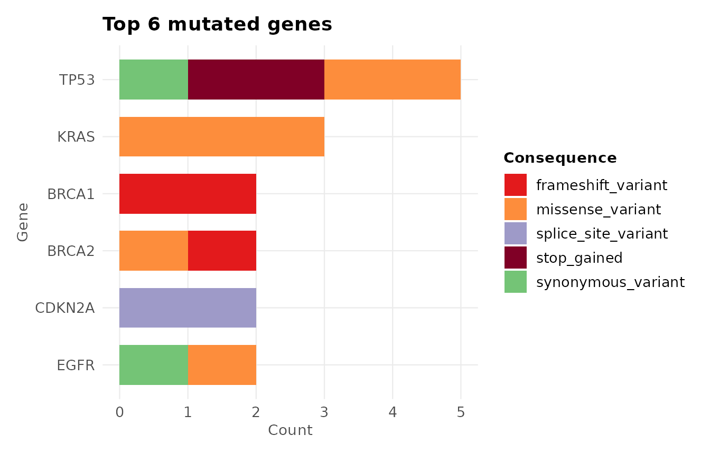
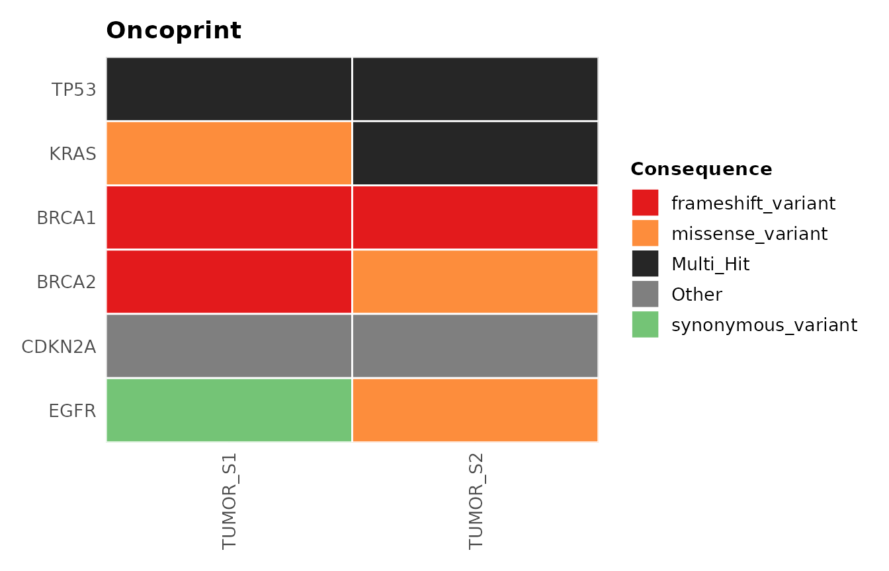
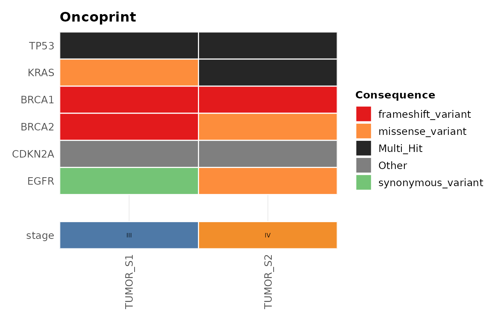
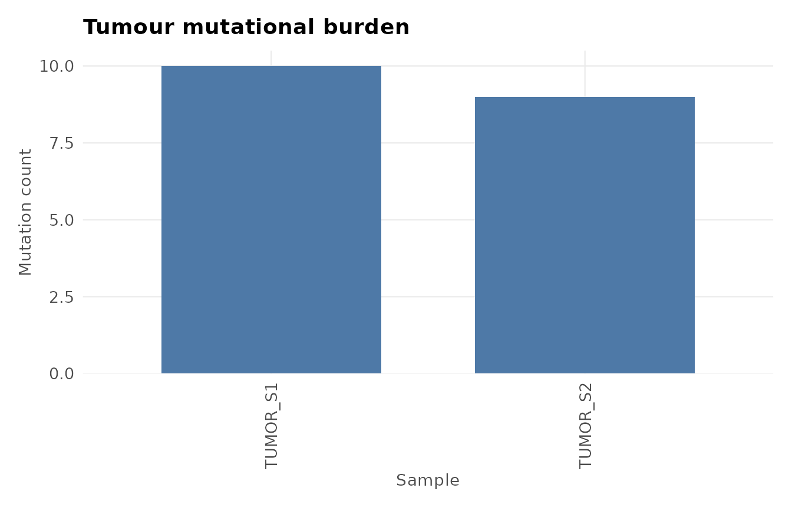

# Gallery

``` r

library(ggvariant)

vcf_file <- system.file("extdata", "example.vcf", package = "ggvariant")
variants <- read_vcf(vcf_file)
#> ℹ Reading VCF: example.vcf
#> ✔ Reading VCF: example.vcf [27ms]
#> 
#> Loaded 19 variant records across 7 chromosomes.
```

This gallery collects one example of every `ggvariant` plot type against
the bundled example VCF. See
[`vignette("ggvariant")`](https://josh45-source.github.io/ggvariant/articles/ggvariant.md)
for a narrated walkthrough, and the function reference for the full
argument list of each plot.

## Lollipop plot

``` r

plot_lollipop(variants, gene = "TP53")
```


## Consequence summary

``` r

plot_consequence_summary(variants, group_by = "gene", top_n = 6)
```



## Mutational spectrum

``` r

plot_variant_spectrum(variants, facet_by_sample = TRUE)
#> Excluded 2 non-SNV records from spectrum plot.
```


## Oncoprint / waterfall plot

[`plot_oncoprint()`](https://josh45-source.github.io/ggvariant/reference/plot_oncoprint.md)
and
[`plot_waterfall()`](https://josh45-source.github.io/ggvariant/reference/plot_oncoprint.md)
are the same function under the two names used by different communities.

``` r

plot_oncoprint(variants, top_n = 6)
```



With a clinical annotation track:

``` r

clinical <- data.frame(
  sample = c("TUMOR_S1", "TUMOR_S2"),
  stage  = c("III", "IV")
)
plot_oncoprint(variants, top_n = 6, annotation = clinical)
```



## Tumour mutational burden

``` r

plot_tmb(variants)
```


