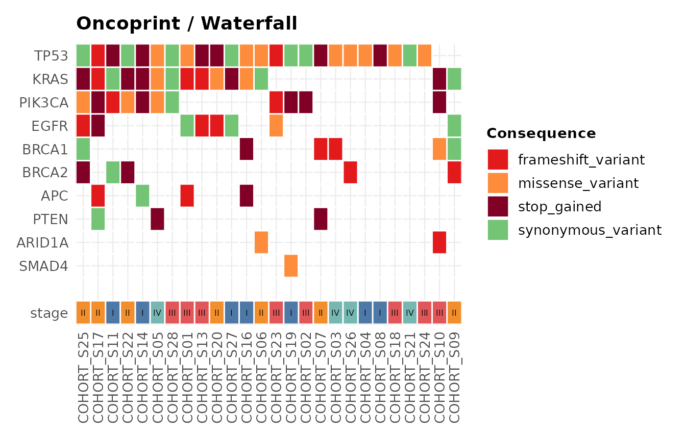

# Gallery

``` r

library(ggvariant)

vcf_file <- system.file("extdata", "example.vcf", package = "ggvariant")
variants <- read_vcf(vcf_file)
#> ℹ Reading VCF: example.vcf
#> ✔ Reading VCF: example.vcf [26ms]
#> 
#> Loaded 19 variant records across 7 chromosomes.
```

This gallery collects one example of every `ggvariant` plot type against
the bundled example VCF. See
[`vignette("ggvariant")`](https://josh45-source.github.io/ggvariant/articles/ggvariant.md)
for a narrated walkthrough, and the function reference for the full
argument list of each plot.

## Lollipop plot

``` r

plot_lollipop(variants, gene = "TP53")
```


## Consequence summary

``` r

plot_consequence_summary(variants, group_by = "gene", top_n = 6)
```


## Mutational spectrum

``` r

plot_variant_spectrum(variants, facet_by_sample = TRUE)
#> Excluded 2 non-SNV records from spectrum plot.
```


## Oncoprint / waterfall plot

[`plot_oncoprint()`](https://josh45-source.github.io/ggvariant/reference/plot_oncoprint.md)
and
[`plot_waterfall()`](https://josh45-source.github.io/ggvariant/reference/plot_oncoprint.md)
are the same function under the two names used by different communities
— “oncoprint” in the `ComplexHeatmap`/ cBioPortal vocabulary, “waterfall
plot” in the `GenVisR`/`maftools` vocabulary. A waterfall plot and an
oncoprint are the same visualisation:
[`plot_waterfall()`](https://josh45-source.github.io/ggvariant/reference/plot_oncoprint.md)
and
[`plot_oncoprint()`](https://josh45-source.github.io/ggvariant/reference/plot_oncoprint.md)
are aliases for one function and produce identical output — use
whichever name your field uses.

The bundled example VCF has only two samples, too few to show the
cascade staircase this plot is built around. The cohort below is
illustrative synthetic data generated just for this article (not the
package’s example data), sized like a real cohort so the staircase and
the annotation track are both visible, with a clinical `stage` track
added via `annotation`:

``` r

set.seed(42)

genes <- c("TP53", "KRAS", "PIK3CA", "EGFR", "BRCA1",
           "BRCA2", "APC", "PTEN", "ARID1A", "SMAD4")
gene_freq <- c(TP53 = 0.85, KRAS = 0.55, PIK3CA = 0.40, EGFR = 0.30,
               BRCA1 = 0.22, BRCA2 = 0.18, APC = 0.14, PTEN = 0.10,
               ARID1A = 0.07, SMAD4 = 0.05)
samples <- sprintf("COHORT_S%02d", 1:28)
consequences <- c("missense_variant", "stop_gained",
                   "frameshift_variant", "synonymous_variant")

cohort <- do.call(rbind, lapply(genes, function(g) {
  n_mut <- max(1, round(gene_freq[[g]] * length(samples)))
  data.frame(
    chrom = "chr1", pos = sample(1e6:2e6, n_mut),
    ref = "A", alt = "T", gene = g,
    sample = sample(samples, n_mut),
    consequence = sample(consequences, n_mut, replace = TRUE),
    stringsAsFactors = FALSE
  )
}))
cohort_variants <- coerce_variants(cohort)

clinical_stage <- data.frame(
  sample = samples,
  stage  = sample(c("I", "II", "III", "IV"), length(samples), replace = TRUE)
)

plot_waterfall(cohort_variants, top_n = 10, annotation = clinical_stage)
```



## Tumour mutational burden

Reusing the same illustrative synthetic cohort from the oncoprint
example above gives a more realistic view of per-sample burden across 28
samples than the two-sample example VCF would:

``` r

plot_tmb(cohort_variants)
```


