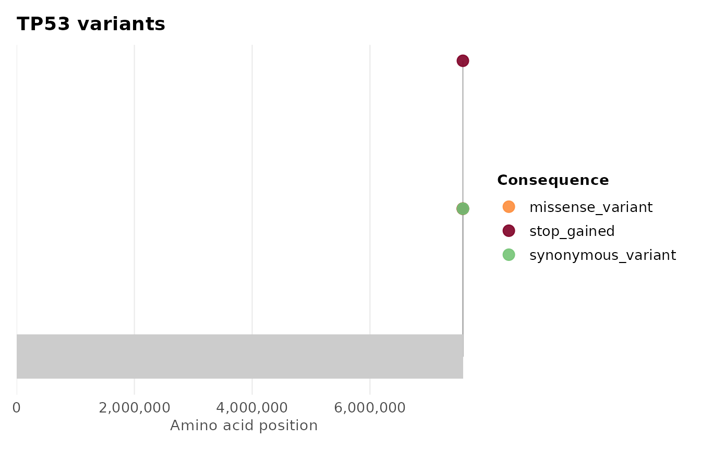
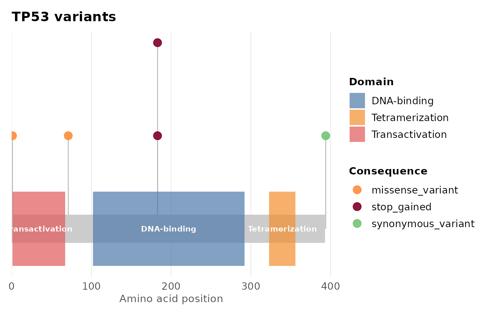
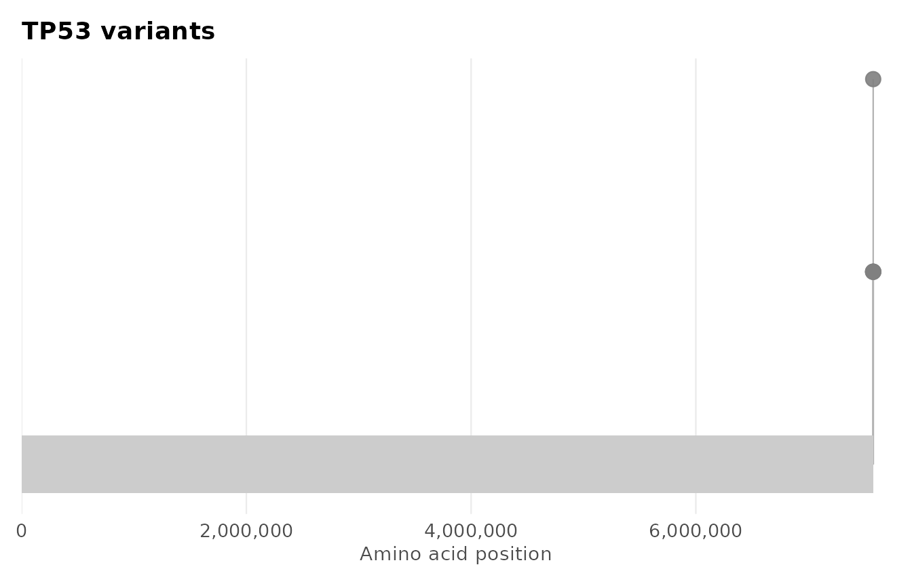
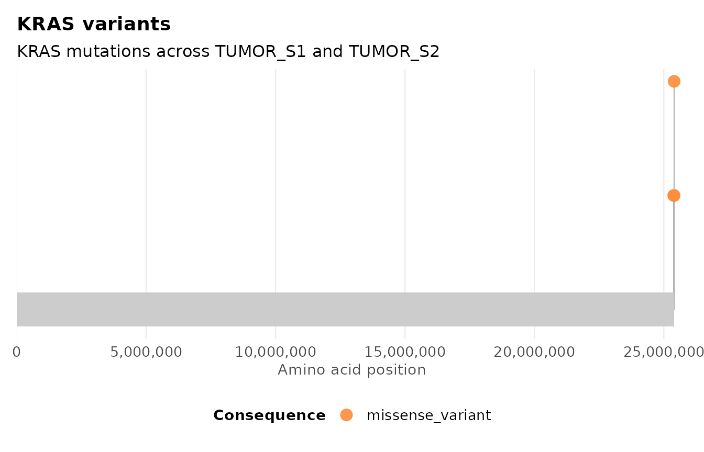
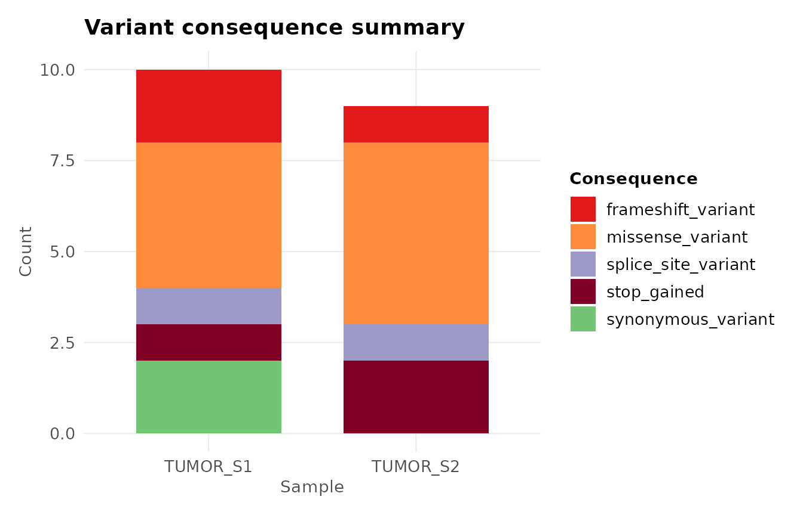
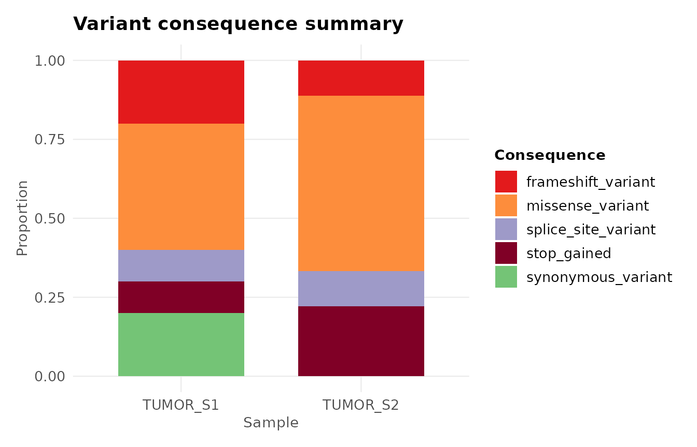
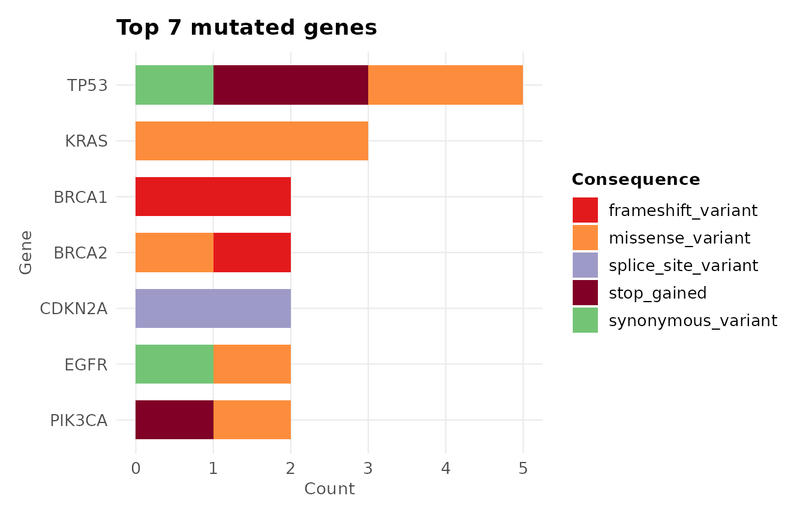
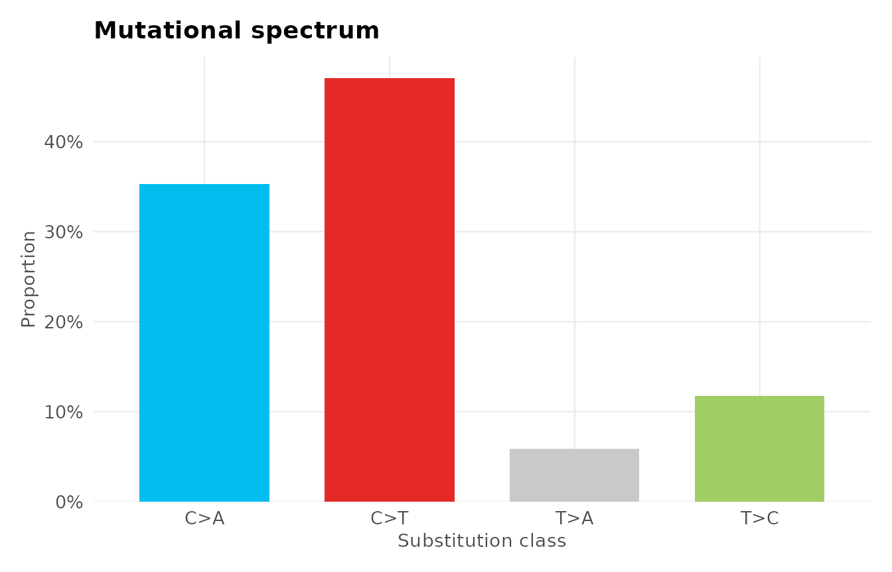
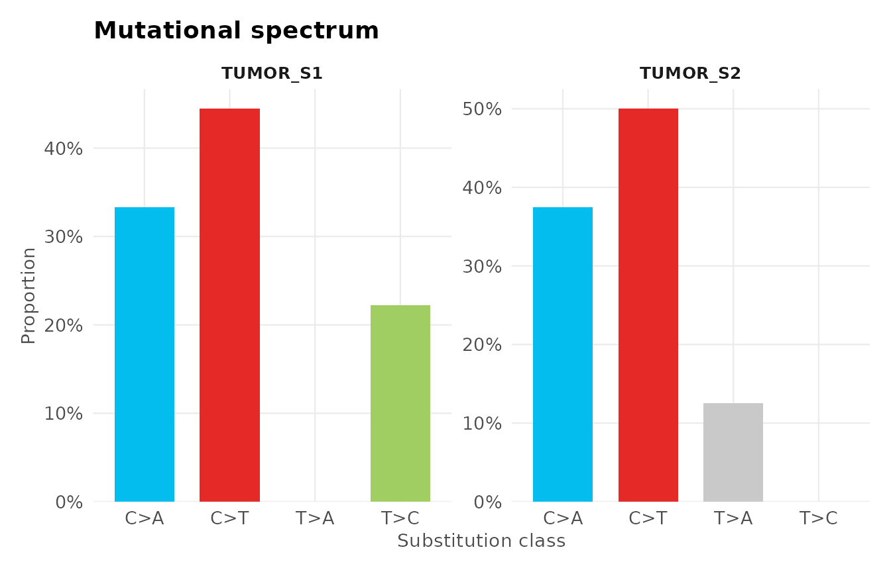

# Getting started with ggvariant

## Overview

This vignette walks through a complete `ggvariant` workflow: loading
variant data from a VCF file or a data frame, plotting variant positions
along a gene, summarising consequences across samples and genes, and
visualising the mutational spectrum. By the end you will have produced
each of the package’s core plot types against the bundled example data
and know how to point them at your own.

## Installation

``` r

# Install from CRAN
install.packages("ggvariant")

# Or install the development version from GitHub
# remotes::install_github("yourname/ggvariant")
```

``` r

library(ggvariant)
```

## Loading variant data

### Option 1: From a VCF file

[`read_vcf()`](https://josh45-source.github.io/ggvariant/reference/read_vcf.md)
parses standard VCF v4.x files — including gzipped files and
multi-sample VCFs — and returns a tidy data frame called a `gvf` object.
Functional annotations from SnpEff (`ANN`) or VEP (`CSQ`) INFO fields
are extracted automatically.

``` r

vcf_file <- system.file("extdata", "example.vcf", package = "ggvariant")
variants  <- read_vcf(vcf_file)
#> ℹ Reading VCF: example.vcf
#> ✔ Reading VCF: example.vcf [64ms]
#> 
#> Loaded 19 variant records across 7 chromosomes.

head(variants)
#> <gvf: 6 variants, 1 sample, 3 chromosomes, 4 genes>
#>   chrom      pos ref alt qual filter        consequence  gene   sample
#> 1 chr17  7577120   C   T  250   PASS   missense_variant  TP53 TUMOR_S1
#> 3 chr17  7578210   G   T   95   PASS        stop_gained  TP53 TUMOR_S1
#> 4 chr17  7579472   A   G  310   PASS synonymous_variant  TP53 TUMOR_S1
#> 6 chr13 32914437   G   A  175   PASS frameshift_variant BRCA2 TUMOR_S1
#> 7 chr17 41244000  AT   A  310   PASS frameshift_variant BRCA1 TUMOR_S1
#> 9  chr7 55242465   C   A   90   PASS synonymous_variant  EGFR TUMOR_S1
```

The result is a plain data frame with one row per variant per sample,
with columns for chromosome, position, alleles, consequence, gene, and
sample name. Because it is a standard data frame, you can filter,
subset, and manipulate it with any R tools you already know.

### Option 2: From a data frame or Excel export

If your variants are in a spreadsheet or the output of another tool, use
[`coerce_variants()`](https://josh45-source.github.io/ggvariant/reference/coerce_variants.md)
to map your column names onto the format `ggvariant` expects. You only
need to specify the columns that differ from the defaults.

``` r

# Example: data exported from a custom pipeline or Excel
my_df <- read.csv("my_variants.csv")

variants <- coerce_variants(my_df,
  chrom       = "Chr",
  pos         = "Position",
  ref         = "Ref_Allele",
  alt         = "Alt_Allele",
  consequence = "Variant_Class",
  gene        = "Hugo_Symbol",
  sample      = "Tumor_Sample"
)
```

Any extra columns in your data frame are carried over automatically, so
you never lose information.

## Lollipop plot

The lollipop plot shows where variants fall along a gene, coloured by
consequence. It is particularly useful for identifying mutational
hotspots — positions that are recurrently mutated across samples.

``` r

plot_lollipop(variants, gene = "TP53")
```



### Adding protein domain annotations

Overlaying known protein domains helps interpret *where* variants fall
functionally. Provide a data frame with `name`, `start`, and `end`
columns (in amino acid coordinates):

``` r

tp53_domains <- data.frame(
  name  = c("Transactivation", "DNA-binding", "Tetramerization"),
  start = c(1,   102, 323),
  end   = c(67,  292, 356)
)

# Scale genomic positions to protein coordinates
tp53 <- variants[variants$gene == "TP53", ]
tp53$pos <- round(
  (tp53$pos - min(tp53$pos)) /
  (max(tp53$pos) - min(tp53$pos)) * 393
) + 1

plot_lollipop(tp53, gene = "TP53",
              domains        = tp53_domains,
              protein_length = 393)
```



### Colouring by sample

To see which sample each variant comes from instead of its consequence,
change `color_by`:

``` r

plot_lollipop(variants, gene = "TP53", color_by = "sample")
#> Warning: No shared levels found between `names(values)` of the manual scale and the
#> data's colour values.
#> No shared levels found between `names(values)` of the manual scale and the
#> data's colour values.
```



### Customising further

Because every `ggvariant` function returns a standard `ggplot` object,
you can add any `ggplot2` layers on top:

``` r

library(ggplot2)

plot_lollipop(variants, gene = "KRAS") +
  labs(subtitle = "KRAS mutations across TUMOR_S1 and TUMOR_S2") +
  theme(legend.position = "bottom")
```



## Consequence summary

[`plot_consequence_summary()`](https://josh45-source.github.io/ggvariant/reference/plot_consequence_summary.md)
gives an overview of what *types* of variants are present — missense,
frameshift, synonymous, and so on — broken down by sample or gene.

### By sample

``` r

plot_consequence_summary(variants)
```



Each bar represents one sample, stacked by consequence type. This
immediately reveals whether two samples have similar or very different
mutational profiles.

### Proportional view

To compare samples with different total variant counts fairly, use
`position = "fill"`:

``` r

plot_consequence_summary(variants, position = "fill")
```



### By gene

To see which genes carry the most variants and what types they are:

``` r

plot_consequence_summary(variants, group_by = "gene", top_n = 7)
```



TP53 stands out immediately as the most mutated gene, a pattern typical
of many cancer cohorts.

## Mutational spectrum

The mutational spectrum shows the relative frequency of each of the six
single-base substitution (SBS) classes — C\>A, C\>G, C\>T, T\>A, T\>C,
T\>G — normalised to the pyrimidine base (so A\>G is represented as
T\>C, matching COSMIC convention).

``` r

plot_variant_spectrum(variants)
#> Excluded 2 non-SNV records from spectrum plot.
```



C\>T substitutions are the most common class in this example. In real
data, a strongly C\>T-dominant spectrum can point to processes such as
UV damage or age-related deamination, though interpreting a signature
reliably requires many more mutations than this small example contains.

### Faceted by sample

To compare mutational processes between samples side by side:

``` r

plot_variant_spectrum(variants, facet_by_sample = TRUE)
#> Excluded 2 non-SNV records from spectrum plot.
```



## Interactive plots

All plot functions support `interactive = TRUE`, which wraps the output
in a `plotly` interactive plot. This is ideal for sharing with
collaborators who don’t use R — simply save as an HTML file and send it.

``` r

# Requires the plotly package
# install.packages("plotly")

p <- plot_lollipop(variants, gene = "TP53", interactive = TRUE)
p  # opens in RStudio viewer or browser
```

## Colour palettes and theming

### Access the built-in palettes

``` r

# See the consequence colour palette
gv_palette("consequence")
#>     missense_variant             missense    Missense_Mutation 
#>            "#FD8D3C"            "#FD8D3C"            "#FD8D3C" 
#>   synonymous_variant           synonymous               Silent 
#>            "#74C476"            "#74C476"            "#74C476" 
#>   frameshift_variant  frameshift_deletion frameshift_insertion 
#>            "#E31A1C"            "#E31A1C"            "#FC4E2A" 
#>          stop_gained    Nonsense_Mutation            stop_lost 
#>            "#800026"            "#800026"            "#BD0026" 
#>  splice_site_variant          Splice_Site    inframe_insertion 
#>            "#9E9AC8"            "#9E9AC8"            "#6BAED6" 
#>     inframe_deletion         In_Frame_Del         In_Frame_Ins 
#>            "#2171B5"            "#2171B5"            "#6BAED6" 
#>  5_prime_UTR_variant  3_prime_UTR_variant       intron_variant 
#>            "#BCBDDC"            "#DADAEB"            "#D9D9D9" 
#>                  SNV             deletion            insertion 
#>            "#BDBDBD"            "#41AB5D"            "#A1D99B" 
#>                  MNV                Other 
#>            "#F768A1"            "#7F7F7F"

# See the COSMIC SBS spectrum palette
gv_palette("spectrum")
#>       C>A       C>G       C>T       T>A       T>C       T>G 
#> "#03BDEE" "#010101" "#E52926" "#CAC9C9" "#A0CE63" "#ECC7C5"
```

### Apply the theme to your own plots

[`theme_ggvariant()`](https://josh45-source.github.io/ggvariant/reference/theme_ggvariant.md)
is exported so you can apply the same clean look to any ggplot2 figure
in your analysis:

``` r

ggplot(my_data, aes(x, y)) +
  geom_point() +
  theme_ggvariant()
```

## Summary

| Function | Input | Output |
|----|----|----|
| [`read_vcf()`](https://josh45-source.github.io/ggvariant/reference/read_vcf.md) | VCF file path | `gvf` data frame |
| [`coerce_variants()`](https://josh45-source.github.io/ggvariant/reference/coerce_variants.md) | Any data frame | `gvf` data frame |
| [`plot_lollipop()`](https://josh45-source.github.io/ggvariant/reference/plot_lollipop.md) | `gvf` + gene name | Lollipop `ggplot` |
| [`plot_consequence_summary()`](https://josh45-source.github.io/ggvariant/reference/plot_consequence_summary.md) | `gvf` | Stacked bar `ggplot` |
| [`plot_variant_spectrum()`](https://josh45-source.github.io/ggvariant/reference/plot_variant_spectrum.md) | `gvf` | SBS spectrum `ggplot` |
| [`gv_palette()`](https://josh45-source.github.io/ggvariant/reference/gv_palette.md) | palette type | Named colour vector |
| [`theme_ggvariant()`](https://josh45-source.github.io/ggvariant/reference/theme_ggvariant.md) | — | `ggplot2` theme |

All plot functions return a `ggplot` object — extend them freely with
standard `ggplot2` syntax, and use `interactive = TRUE` with any of them
to get a `plotly` interactive version.

## Session information

``` r

sessionInfo()
#> R version 4.6.1 (2026-06-24)
#> Platform: x86_64-pc-linux-gnu
#> Running under: Ubuntu 24.04.4 LTS
#> 
#> Matrix products: default
#> BLAS:   /usr/lib/x86_64-linux-gnu/openblas-pthread/libblas.so.3 
#> LAPACK: /usr/lib/x86_64-linux-gnu/openblas-pthread/libopenblasp-r0.3.26.so;  LAPACK version 3.12.0
#> 
#> locale:
#>  [1] LC_CTYPE=C.UTF-8       LC_NUMERIC=C           LC_TIME=C.UTF-8       
#>  [4] LC_COLLATE=C.UTF-8     LC_MONETARY=C.UTF-8    LC_MESSAGES=C.UTF-8   
#>  [7] LC_PAPER=C.UTF-8       LC_NAME=C              LC_ADDRESS=C          
#> [10] LC_TELEPHONE=C         LC_MEASUREMENT=C.UTF-8 LC_IDENTIFICATION=C   
#> 
#> time zone: UTC
#> tzcode source: system (glibc)
#> 
#> attached base packages:
#> [1] stats     graphics  grDevices utils     datasets  methods   base     
#> 
#> other attached packages:
#> [1] ggplot2_4.0.3   ggvariant_0.2.0
#> 
#> loaded via a namespace (and not attached):
#>  [1] gtable_0.3.6       jsonlite_2.0.0     dplyr_1.2.1        compiler_4.6.1    
#>  [5] tidyselect_1.2.1   jquerylib_0.1.4    systemfonts_1.3.2  scales_1.4.0      
#>  [9] textshaping_1.0.5  yaml_2.3.12        fastmap_1.2.0      R6_2.6.1          
#> [13] labeling_0.4.3     generics_0.1.4     knitr_1.51         htmlwidgets_1.6.4 
#> [17] tibble_3.3.1       desc_1.4.3         bslib_0.12.0       pillar_1.11.1     
#> [21] RColorBrewer_1.1-3 rlang_1.3.0        cachem_1.1.0       xfun_0.60         
#> [25] fs_2.1.0           sass_0.4.10        S7_0.2.2           otel_0.2.0        
#> [29] cli_3.6.6          pkgdown_2.2.1      withr_3.0.3        magrittr_2.0.5    
#> [33] digest_0.6.39      grid_4.6.1         lifecycle_1.0.5    vctrs_0.7.3       
#> [37] evaluate_1.0.5     glue_1.8.1         farver_2.1.2       ragg_1.5.2        
#> [41] rmarkdown_2.31     tools_4.6.1        pkgconfig_2.0.3    htmltools_0.5.9
```
