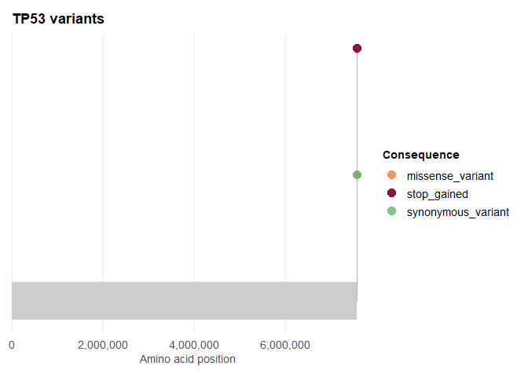
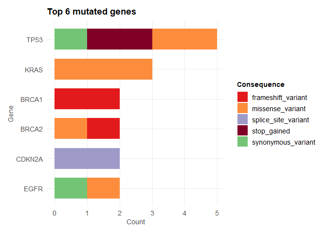
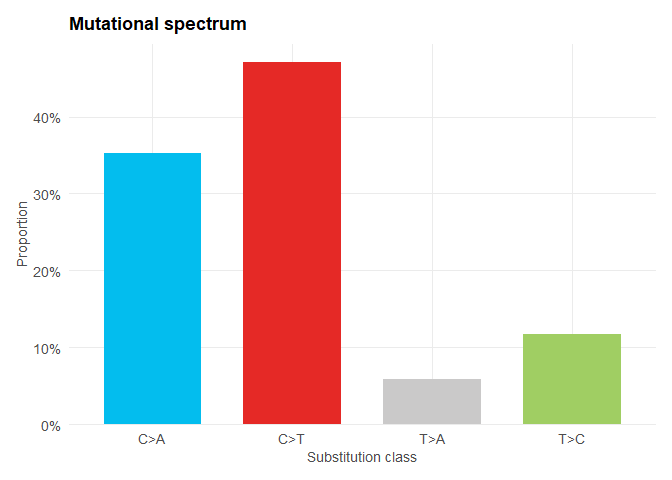
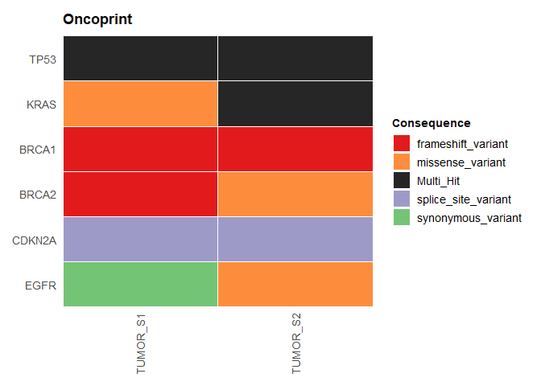
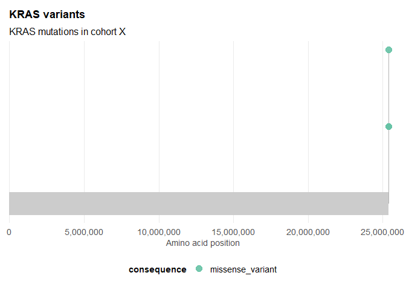

# ggvariant

ggvariant reads variant data from a VCF file or a plain data frame and
produces `ggplot2` plots for common tasks in variant review: lollipop
plots of variant position along a gene, consequence summaries by sample
or gene, mutational spectrum charts, and cohort-level comparisons such
as oncoprints and per-sample mutation burden. Every function accepts
either input format and returns a standard `ggplot` object, so the
result composes with any `ggplot2` layer, scale, or theme you already
use. Designed for both wet-lab biologists and experienced
bioinformaticians.

## Installation

Install the released version from CRAN:

``` r

install.packages("ggvariant")
```

Install the development version from GitHub:

``` r

# install.packages("remotes")
remotes::install_github("josh45-source/ggvariant")
```

## Example

Read a VCF file and plot variant positions along a gene:

``` r

library(ggvariant)

vcf_file <- system.file("extdata", "example.vcf", package = "ggvariant")
variants <- read_vcf(vcf_file)

plot_lollipop(variants, gene = "TP53")
```



If your data is already in a data frame — a spreadsheet export, say,
rather than a VCF file —
[`coerce_variants()`](https://josh45-source.github.io/ggvariant/reference/coerce_variants.md)
maps your column names onto the same tidy format instead.

## Overview

- **Reading and coercing variants** —
  [`read_vcf()`](https://josh45-source.github.io/ggvariant/reference/read_vcf.md)
  parses VCF v4.x files, including gzipped and multi-sample files, and
  extracts SnpEff (`ANN`) or VEP (`CSQ`) annotations automatically.
  [`coerce_variants()`](https://josh45-source.github.io/ggvariant/reference/coerce_variants.md)
  remaps an existing data frame’s columns onto the same format.
- **Plots** —
  [`plot_lollipop()`](https://josh45-source.github.io/ggvariant/reference/plot_lollipop.md),
  [`plot_consequence_summary()`](https://josh45-source.github.io/ggvariant/reference/plot_consequence_summary.md),
  [`plot_variant_spectrum()`](https://josh45-source.github.io/ggvariant/reference/plot_variant_spectrum.md),
  [`plot_oncoprint()`](https://josh45-source.github.io/ggvariant/reference/plot_oncoprint.md)
  (also
  [`plot_waterfall()`](https://josh45-source.github.io/ggvariant/reference/plot_oncoprint.md),
  an alias for the same function), and
  [`plot_tmb()`](https://josh45-source.github.io/ggvariant/reference/plot_tmb.md).
- **Palettes and themes** —
  [`gv_palette()`](https://josh45-source.github.io/ggvariant/reference/gv_palette.md)
  and
  [`theme_ggvariant()`](https://josh45-source.github.io/ggvariant/reference/theme_ggvariant.md)
  expose the built-in colours and plot theme for reuse in plots you
  build yourself.

A few of the other plot types, on the same example data:

``` r

plot_consequence_summary(variants, group_by = "gene", top_n = 6)
```



``` r

plot_variant_spectrum(variants)
```



``` r

plot_oncoprint(variants, top_n = 6)
```



See
[`vignette("ggvariant")`](https://josh45-source.github.io/ggvariant/articles/ggvariant.md)
for a full walkthrough — domain annotations, colouring by sample,
proportional and faceted views, interactive `plotly` output — or the
[function
reference](https://josh45-source.github.io/ggvariant/reference/) for
argument details.

## Customisation

Every function returns a standard `ggplot` object, so any `ggplot2`
layer, scale, or theme composes onto it directly:

``` r

library(ggplot2)

plot_lollipop(variants, gene = "KRAS") +
  scale_colour_brewer(palette = "Set2") +
  theme(legend.position = "bottom") +
  labs(subtitle = "KRAS mutations in cohort X")
```



## Package structure

``` R
ggvariant/
├── R/
│   ├── ggvariant-package.R       # Package documentation
│   ├── read_vcf.R                # read_vcf() and coerce_variants()
│   ├── plot_lollipop.R           # plot_lollipop()
│   ├── plot_functions.R          # plot_consequence_summary(), plot_variant_spectrum()
│   └── utils.R                   # Theme, palettes, shared helpers
├── tests/
│   └── testthat/
│       └── test-core.R           # Unit tests
├── inst/
│   └── extdata/
│       └── example.vcf           # Bundled example VCF
├── DESCRIPTION
└── NAMESPACE
```

## Roadmap

[`plot_oncoprint()`](https://josh45-source.github.io/ggvariant/reference/plot_oncoprint.md)
— sample × gene mutation matrix

`plot_copy_number()` — CNV segment visualisation

`plot_rainfall()` — kataegis / mutation density along genome

[`plot_tmb()`](https://josh45-source.github.io/ggvariant/reference/plot_tmb.md)
— tumour mutation burden comparison across cohorts

BSgenome integration for automatic trinucleotide context extraction

Shiny module for non-coding users

## Contributing

Pull requests are welcome. Please open an issue first to discuss
proposed changes. All contributions should include tests.

## Acknowledgements

The waterfall/oncoprint visualisation in v0.2.0 was suggested by Dr
Nour-al-dain Marzouka.

## License

MIT

## Citation

If you use `ggvariant` in your research, please cite:

Ayo, J. J. (2026). *ggvariant: Tidy, ggplot2-native visualization for
genomic variants* (R package version 0.1.0). CRAN.
<https://doi.org/10.32614/CRAN.package.ggvariant>
